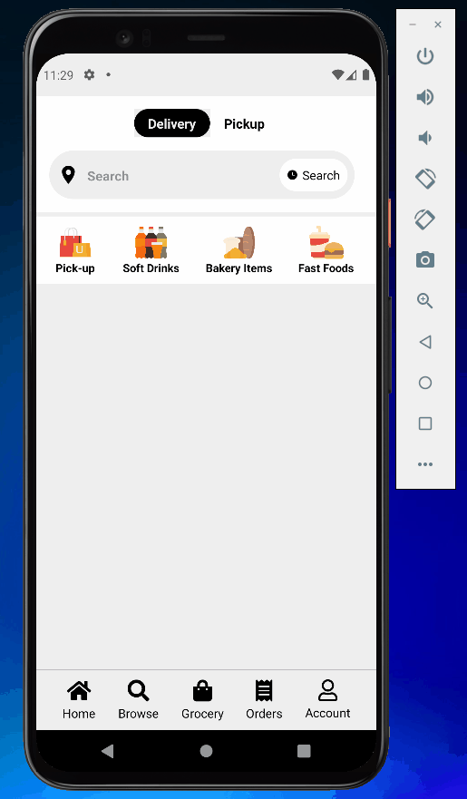

<!-- Please update value in the {}  -->

<h1 align="center">React Native Uber Eats Clone</h1>

<!-- TABLE OF CONTENTS -->

## Table of Contents

- [Table of Contents](#table-of-contents)
- [Overview](#overview)
  - [Built With](#built-with)
- [How To Use](#how-to-use)
- [Acknowledgements](#acknowledgements)
- [Contact](#contact)

<!-- OVERVIEW -->

## Overview



### Built With

<!-- This section should list any major frameworks that you built your project using. Here are a few examples.-->

- React Native EXPO CLI
- Firebase
- Redux
- Google Places Autocomplete
- React Native Reanimated

## How To Use

<!-- This is an example, please update according to your application -->

To clone and run this application, you'll need [Git](https://git-scm.com)

```bash
# Clone this repository
$ git clone https://github.com/hsynarsln/React-native-uber-clone.git
$ cd client/

# Install dependencies
    > npm install

# Run the app
$ npm run dev
```

## Acknowledgements

- Information for your projects

## Contact

- Email (hsyn06arslan@gmail.com)

- GitHub (https://github.com/hsynarsln)

- Linkedin (https://www.linkedin.com/in/huseyinarsln/)
